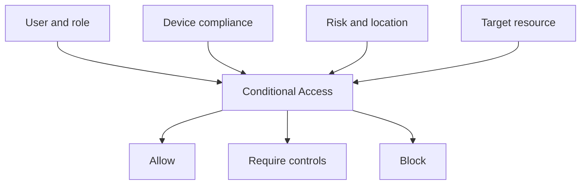

# Zero Trust Access Lab

> An identity-and-device access-control lab based on the principles: verify explicitly, use least privilege, and assume breach.

**Status:** Architecture and planning  
**Client:** Northstar Telehealth Solutions *(fictional)*  
**Primary roles demonstrated:** Identity Security Engineer · Zero Trust Consultant · Solutions Engineer

## Executive Summary

Northstar needs to protect sensitive clinical, financial, and administrative resources without treating every user, device, application, and location as equally trusted.

This lab connects Microsoft Entra ID and Microsoft Intune so access decisions can consider the user, authentication strength, role, application, location, risk, and device compliance.

## Decision Architecture



## Personas

| Persona | Resource sensitivity | Proposed access expectation |
|---|---|---|
| Standard employee | Productivity apps | MFA; managed device for sensitive data |
| Clinician | Clinical applications | Strong authentication and compliant device |
| Contractor | Limited project resources | Time-bound group membership and MFA |
| Administrator | Privileged portals | Phishing-resistant authentication and controlled activation |
| Guest partner | Shared collaboration content | Scoped access, MFA, expiration, and review |

## Planned Policy Scenarios

1. Require MFA for workforce access.
2. Block legacy authentication.
3. Require compliant devices for selected sensitive applications.
4. Protect administrator access with stronger controls.
5. Restrict access from unapproved locations where justified.
6. Govern guest and contractor access.
7. Evaluate risk-based controls when licensing permits.
8. Protect security-information registration.
9. Preserve tested emergency access.

## Safe Rollout Method

- Confirm prerequisites and licensing.
- Identify emergency, service, and synchronization accounts.
- Create narrowly scoped pilot groups.
- Configure policies in report-only mode.
- Run “What If” and documented user-journey tests.
- Review sign-in logs and unexpected impacts.
- Remediate dependencies and approve change.
- Enforce in waves with rollback criteria.
- Monitor policy coverage and exceptions.

## Test Matrix

| Test | Expected outcome |
|---|---|
| Standard user, approved authentication | MFA challenge and successful access |
| User with legacy protocol | Access blocked |
| Clinician on compliant device | Sensitive application allowed |
| Clinician on noncompliant device | Access blocked or remediation required |
| Administrator activating privilege | Strong authentication and documented activation |
| Approved emergency account | Accessible under tightly monitored exclusion |
| Guest after expiration | Access removed |

## Evidence to Capture

- Policy configuration with sensitive identifiers removed
- Named locations and group-assignment logic
- Report-only insights
- What If results
- Sanitized sign-in logs
- Device compliance state
- Pass/fail test record
- Exception and rollback decisions
- Before-and-after access journey

## Success Measures

- Every policy maps to a business requirement and threat scenario
- No enforcement occurs without tested exclusions and rollback
- Expected user journeys pass
- Failed access can be explained from sign-in and device evidence
- Privileged and guest access has defined ownership and review
- Exceptions are time-bound and documented

## Repository Roadmap

- [ ] Complete requirements and threat model
- [ ] Create persona-to-resource matrix
- [ ] Write policy specifications
- [ ] Build report-only deployment plan
- [ ] Integrate test Intune compliance signals
- [ ] Execute access journeys
- [ ] Publish results and lessons learned

## Planned Repository Structure

```text
architecture/      Decision flows and trust boundaries
requirements/      Personas, resources, and access expectations
policies/          Conditional Access specifications
threat-model/      Threats, mitigations, and residual risk
testing/           User journeys, pass/fail results, evidence
operations/        Monitoring, exceptions, and rollback
```

## Related Portfolio Projects

- [Entra ID Enterprise Implementation](https://github.com/sclem34/entra-id-enterprise-implementation)
- [Intune Secure Endpoint Deployment](https://github.com/sclem34/intune-secure-endpoint-deployment)

## Disclaimer

This project uses a fictional company and sanitized lab data. It is not a production deployment guide. All implementation claims will be supported with test evidence.
